# Лабораторная работа №6 Система контроля версий 


### Цель работы

Изучение базовых возможностей системы управления версиями, получение опыта работы с Git API, локальным и удалённым репозиторием.

## Ход работы

На сайте GitHub ранее уже был создан аккаунт, поэтому первым шагом было выполнить форк репозитория из методических указаний к лабораторной работе.

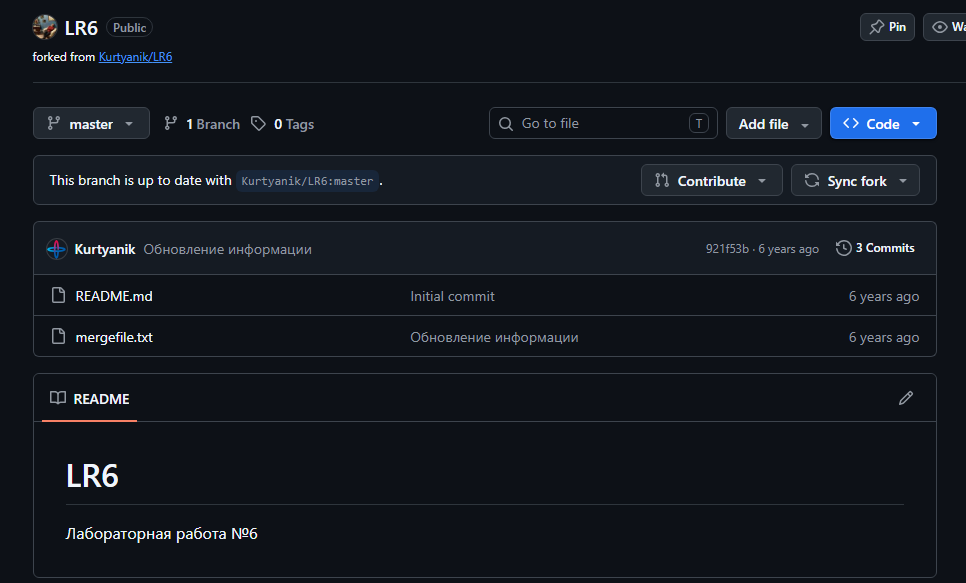

Клиент Git уже был настроен для работы, поэтому настройки были проверены.

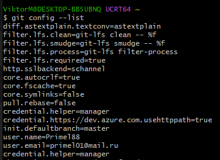

Далее была выполнена команда `git clone` для клонирования удалённого репозитория.

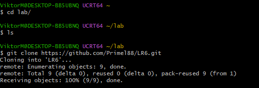

После клонирования был создан новый текстовый файл, добавлен в репозиторий и отправлен в удалённый репозиторий с помощью `git push`.

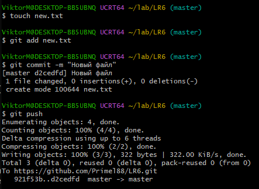

По заданию необходимо было получить историю операций для каждой из веток. Сначала было определено количество веток в репозитории с помощью команды:

```bash
git branch
```

Так как в репозитории была только одна ветка — `master`, с помощью команды `git log` была получена история её операций.

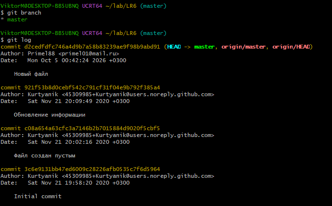

Далее с помощью команды:

```bash
git log -p
```

в консоль были выведены подробные изменения, выполненные в каждом из коммитов репозитория.

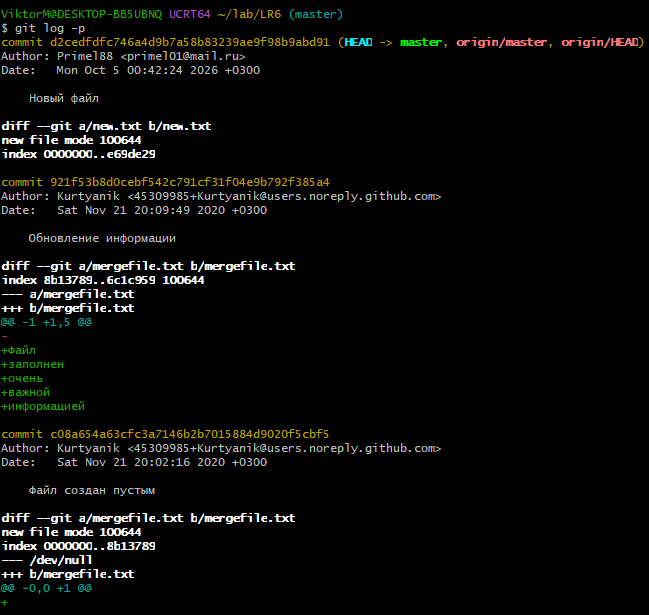

Для выполнения последующих действий необходимо было создать новую ветку. Новая ветка `new` была создана с помощью команды:

```bash
git branch new
```

После этого командой `git branch` была получена информация о существующих ветках репозитория.

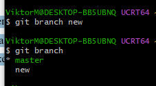

Для новой ветки также необходимо было получить историю изменений. Сначала с помощью команды:

```bash
git checkout new_master
```

было выполнено переключение с исходной ветки `master` на новую ветку. После этого с помощью ранее использованных команд `git log` и `git log -p` была получена информация обо всех изменениях в ветке и её последних изменениях.

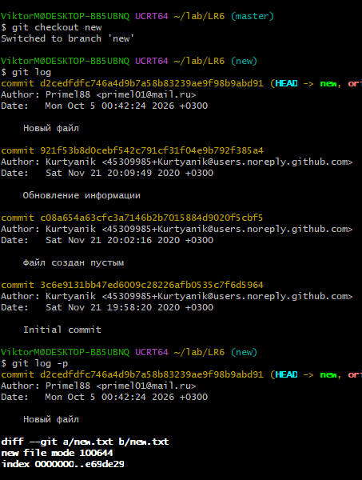

Для слияния двух веток необходимо было сначала переключиться на ветку `master`:

```bash
git checkout master
```

После этого было выполнено слияние:

```bash
git merge new
```

Слияние произошло без конфликтов, поскольку ветки были идентичны.

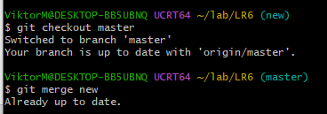

Результат выполнения операции `merge` был проверен.

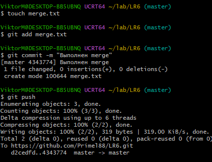

После слияния побочная ветка `new` была удалена командой:

```bash
git branch -d new
```

После этого был создан файл `del.txt` и выполнен новый коммит, в котором была зафиксирована работа с удалением ветки.

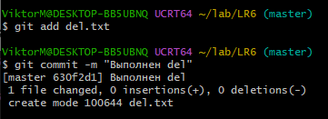

Для проверки возможности отката коммита был создан файл `otkat.txt`. После этого с помощью команды `git revert` была выполнена отмена соответствующего изменения.

```bash
git revert
```

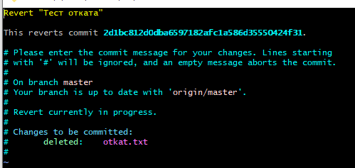

Для отчёта была создана специальная ветка `otchet`. В данной ветке, а именно в файле `README.md`, хранится настоящий отчёт по лабораторной работе.

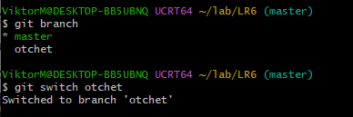

Начало работы над отчётом представлено на следующем рисунке.

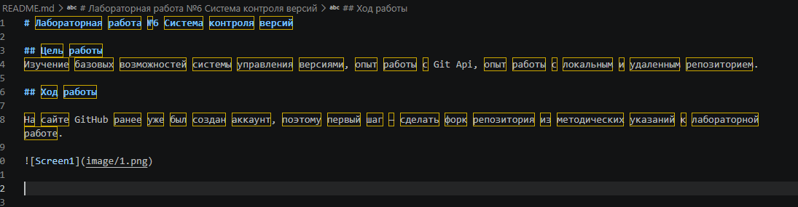

После этого была настроена возможность выполнения коммитов в ветку `otchet`.

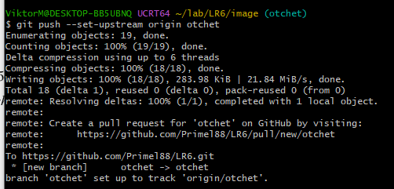

Результат работы с репозиторием на GitHub представлен ниже.

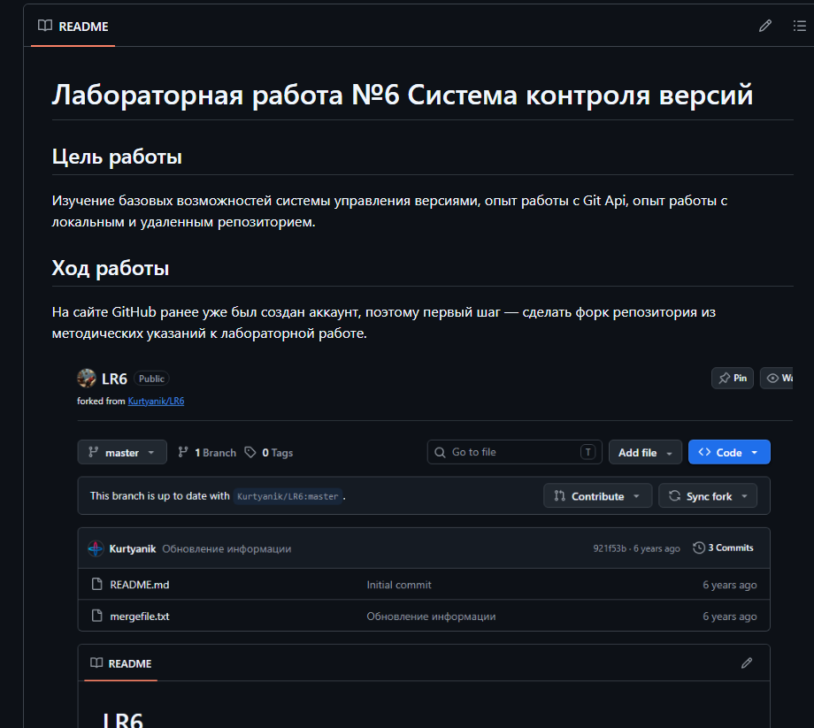

Для получения истории операций в форматированном виде была использована команда:

```bash
git log --pretty=format:"%h -- %cd, %an : %s"
```

В ней используются следующие параметры:

- `%h` — сокращённый хэш коммита;
- `%cd` — дата коммита;
- `%an` — имя автора;
- `%s` — комментарий к коммиту.

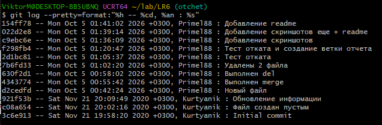

Одним из последних этапов было получение истории введённых Git-команд без вывода результатов их выполнения. Для этого использовалась команда:

```bash
history | grep "git"
```

Команда `history` выводит историю введённых команд, а `grep "git"` позволяет отфильтровать из неё строки, содержащие `git`.

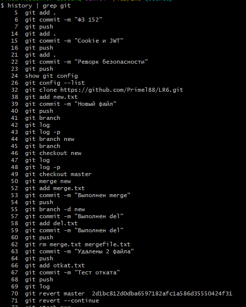

## Выводы

Изучены базовые возможности системы управления версиями, получен опыт 
работы с Git Api, получен опыт работы с локальным и удалённым репозиторием.